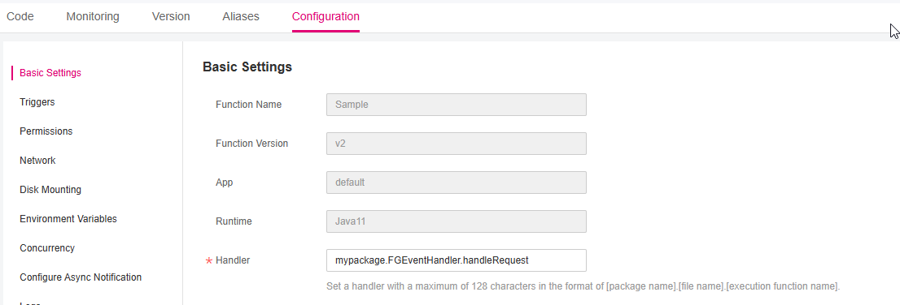

Define FunctionGraph function handler in Java
=============================================

Setting up the java handler project
-----------------------------------

A typical Java FunctionGraph project is typically structured as follows:

.. code-block:: console
  :emphasize-lines: 6
  :caption: Project structure

  /project-root
  ├─ src
  |  └─ main
  |     └─ java
  |        └─ mypackage
  |           └─ FGEventHandler.java              # (contains main handler handleRequest())
  |           └─ <other_supporting_classes>
  └─  pom.xml or build.gradle

The main logic for the function resides in Java file
`src/main/java/mypackage` folder.
When deploying to FunctionGraph make sure to specify the correct handler:

[**Package name**].[**Class name**].handleRequest

In this example the handler is: `mypackage.FGEventHandler.handleRequest`.

Example code for Java FunctionGraph function
--------------------------------------------

The following example receives an event.

.. code-block:: java
  :caption: Example: FGEventHandler.java
  :name:  FGEventHandler_java

  package mypackage;

  import com.google.gson.JsonObject;
  import com.opentelekomcloud.services.runtime.Context;
  import com.opentelekomcloud.services.functiongraph.runtime.core.RequestHandler

  public class FGEventHandler implements RequestHandler<JsonObject, String> {

    @Override
    public String handleRequest(JsonObject event, Context context) {

      return "Success";
    }
  }

Valid class definitions for Java handlers
-----------------------------------------
To simplify handler configuration and validate the method signature
at compile time the ``opentelekomcloud-functiongraph-java-core``
library defines following interface:

* :github_repo_master:`com.opentelekomcloud.services.functiongraph.runtime.core.RequestHandler <opentelekomcloud-functiongraph-java-core/src/main/java/com/opentelekomcloud/services/functiongraph/runtime/core/RequestHandler.java>`

The RequestHandler interface is a generic type that takes two parameters:

* the ``input`` type and
* the ``output`` type.

Both types must be Java objects. In this example, our FGEventHandler class
implements ``RequestHandler<FGEventHandler.EventData, String>``.

The:
* input type is ``EventData`` defined within the class, and
* output type is ``String``.

.. code-block:: java

  public class FGEventHandler implements RequestHandler<FGEventHandler.EventData, String> {

    @Override
    public String handleRequest(FGEventHandler.EventData event, Context context) {
      ...
      return "Success";
    }

    public class EventData {
     ...
    }

  }

When using this interface, the Java runtime deserializes the event into the
object with the ``input`` type, and serializes the ``output`` into text.

Use this interface when the built-in serialization works with your input
and output types.

Defining and accessing the input event object
---------------------------------------------

JSON is the most common and standard input format for FunctionGraph functions.
In this example, the function expects an input similar to the following:

.. code-block:: json
    :caption: Input data as json

    {
      "id": "aba006fd-d743-4909-959b-7189ee3fad09",
      "amount": 290.00,
      "item": "Hard disc"
    }

For this example we define following data object:

.. tabs::

  .. tab:: EventData POJO

      .. code-block:: java
        :caption: EventData

        public class EventData {
          String id;
          double amount;
          String item;

          public String getId(){
            return this.id;
          }

          public void setId(String value){
            this.id=value;
          }

          public String getId(){
            return this.id;
          }

          public void setAmount(double value){
            this.amount=value;
          }

          public double getAmount(){
            return this.amount;
          }

          public String getItem(){
            return this.item;
          }

          public void setItem(String value){
            this.item=value;
          }

        }

  .. tab:: EventData using Lombok

      .. code-block:: java
        :caption: EventData

        import com.google.gson.annotations.SerializedName;
        import lombok.Data;
        import lombok.ToString;

        @Data
        @ToString
        public class EventData {

          @SerializedName("id")
          String id;

          @SerializedName("amount")
          double amount;

          @SerializedName("item")
          String item;

        }

This object matches the expected input data.
After you define your object, you can write a handler signature
that takes in a JSON input that conforms to the record definition.
The Java runtime automatically deserializes this JSON into a Java object
and the fields of the object can be accessed.

For example, ``event.getId()`` retrieves the value of Id from the
original input.

Event Types of OpenTelekomCloud services
----------------------------------------

For predefined OpenTelekomCloud service events, use:
``com.opentelekomcloud.services.functiongraph.runtime.core.EventRequestHandler``
instead of
``com.opentelekomcloud.services.functiongraph.runtime.core.RequestHandler``

.. code-block:: java
  :caption: Example: SMNEventHandler.java
  :name:  SMNEventHandler_java

  package mypackage;

  import com.google.gson.JsonObject;
  import com.opentelekomcloud.services.runtime.Context;
  import com.opentelekomcloud.services.functiongraph.runtime.core.EventRequestHandler

  public class SMNEventHandler implements EventRequestHandler<SMNTriggerEvent, String> {

    @Override
    public String handleRequest(SMNTriggerEvent event, Context context) {

      return "ok";
    }
  }

For events sent by other OpenTelekomCloud services, there are predefined
types in:

* :github_repo_master:`com.opentelekomcloud.services.functiongraph.runtime.events <opentelekomcloud-functiongraph-java-events/src/main/java/com/opentelekomcloud/services/functiongraph/runtime/events>`

.. list-table:: **Table 1** Events
   :widths: 25 20 8 50
   :header-rows: 1

   * - Service
     - Short
     - Calling method
     - Source

   * - API Gateway (Dedicated Gateway)
     - APIG
     - sync
     - :github_repo_master:`com.opentelekomcloud.services.functiongraph.runtime.events.apig <opentelekomcloud-functiongraph-java-events/src/main/java/com/opentelekomcloud/services/functiongraph/runtime/events/apig>`

   * - Cloud Trace Service
     - CTS
     - async
     - :github_repo_master:`com.opentelekomcloud.services.functiongraph.runtime.events.cts <opentelekomcloud-functiongraph-java-events/src/main/java/com/opentelekomcloud/services/functiongraph/runtime/events/cts>`

   * - Document Database Service
     - DDS
     - Async
     - :github_repo_master:`com.opentelekomcloud.services.functiongraph.runtime.events.dds <opentelekomcloud-functiongraph-java-events/src/main/java/com/opentelekomcloud/services/functiongraph/runtime/events/dds>`

   * - DMS for Kafka
     - DMS4Kafka
     - sync
     - :github_repo_master:`com.opentelekomcloud.services.functiongraph.runtime.events.dms4kafka <opentelekomcloud-functiongraph-java-events/src/main/java/com/opentelekomcloud/services/functiongraph/runtime/events/dms4kafka>`

   * - Kafka (OPENSOURCEKAFKA)
     - KAFKA
     - async
     - :github_repo_master:`com.opentelekomcloud.services.functiongraph.runtime.events.kafka <opentelekomcloud-functiongraph-java-events/src/main/java/com/opentelekomcloud/services/functiongraph/runtime/events/kafka>`

   * - Log Tank Service
     - LTS
     - async
     - :github_repo_master:`com.opentelekomcloud.services.functiongraph.runtime.events.lts <opentelekomcloud-functiongraph-java-events/src/main/java/com/opentelekomcloud/services/functiongraph/runtime/events/lts>`

   * - S3 Object Storage Service
     - S3OBS
     - async
     - :github_repo_master:`com.opentelekomcloud.services.functiongraph.runtime.events.s3obs <opentelekomcloud-functiongraph-java-events/src/main/java/com/opentelekomcloud/services/functiongraph/runtime/events/s3obs>`

   * - Simple Message Notification
     - SMN
     - async
     - :github_repo_master:`com.opentelekomcloud.services.functiongraph.runtime.events.smn <opentelekomcloud-functiongraph-java-events/src/main/java/com/opentelekomcloud/services/functiongraph/runtime/events/smn>`

   * - Timer
     - Timer
     - async
     - :github_repo_master:`com.opentelekomcloud.services.functiongraph.runtime.events.timer <opentelekomcloud-functiongraph-java-events/src/main/java/com/opentelekomcloud/services/functiongraph/runtime/events/timer>`

Accessing and using the FunctionGraph context object
----------------------------------------------------

The :doc:`Context<./context>` interface allows functions to obtain the
function execution context, such as information about the invocation,
function, execution environment, and so on.

The context is of type ``com.opentelekomcloud.services.runtime.Context``
and is the second argument of the handler function.

* :github_repo_master:`com.opentelekomcloud.services.runtime.Context <opentelekomcloud-functiongraph-java-core/src/main/java/com/opentelekomcloud/services/runtime/Context.java>`

To produce logs in OpenTelekomCloud Log Tank Servics (LTS) you can use
``context.getLogger()`` to get a RuntimeLogger object for logging.

.. code-block:: java

  context.getLogger().log("Hello world!");

Besides of logging, you can also use the context object for
function monitoring.
For more information about the context object,
see :doc:`Using the FunctionGraph context object to retrieve Java function information.<./context>`

Accessing environment variables
-------------------------------

Environment variables defined in ``OpenTelekomCloud`` ->
``Configuration`` -> ``Environment Variables`` can be accessed using:

.. code-block:: java

  // accessing an environment variable named "ENV_VAR1"
  context.getUserData("ENV_VAR1");
